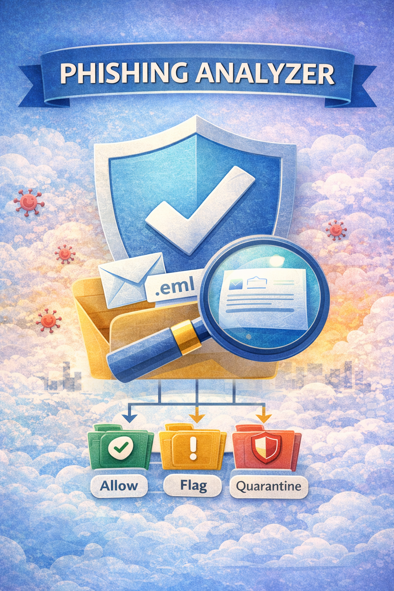
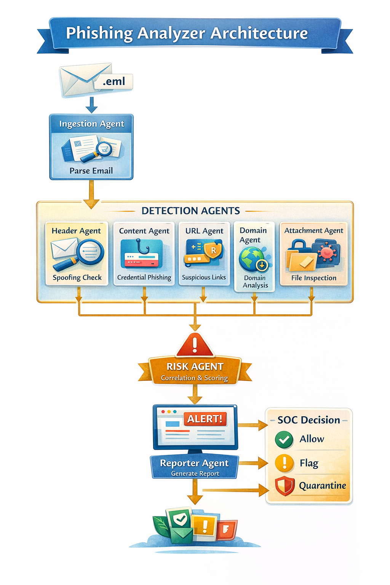

# 🛡️ Phishing Analyzer  
**Multi-Agent Email Security System**

[](images/title.png)

A **SOC-grade phishing detection system** that analyzes raw `.eml` email files using a **multi-agent architecture**, producing deterministic risk scores and actions such as **Allow**, **Flag**, or **Quarantine**.

Designed to **simulate real-world enterprise email security pipelines**.

---
## 🌍 Real-World Cybersecurity Impact

- This system demonstrates how multi-agent AI can improve phishing detection in real-world security environments.
- Helps security teams automatically analyze suspicious emails
- Reduces manual phishing investigation time
- Provides explainable phishing risk scoring
- Allows human analysts to validate decisions before blocking emails
- The architecture reflects how modern Security Operations Centers (SOC) combine automated detection, AI reasoning, and human oversight to prevent phishing attacks safely.

---

## ✨ Key Highlights

- 📧 Analyze raw `.eml` email files  
- 🤖 Multi-Agent architecture (Header, Content, URL, Domain, Attachment)  
- 🔗 SOC-style **cross-agent correlation**  
- 📊 Deterministic **risk scoring (0–100)**  
- 🚨 Final actions: **Allow / Flag / Quarantine**  
- 🧪 Demo mode with phishing samples  
- 🧠 Real credential-phishing detection  
- 🖥️ Interactive **Streamlit UI**  
- 🧪 70%+ test coverage with pytest  

---

## 🧠 System Architecture

The system processes emails using **independent detection agents**, then correlates their findings using SOC-style logic.

[](images/architecture.png)

---

## 📂 Project Structure

```text
```text
phishing-analyzer-prod/
│
├── __init__.py
├── logging_config.py
├── health.py
├── app/
│   └── app.py                  # Streamlit UI
│
├── phishing_analyzer/
│   ├── agents/
│   │   ├── ingestion.py
│   │   ├── header_agent.py
│   │   ├── content_agent.py
│   │   ├── url_agent.py
│   │   ├── domain_agent.py
│   │   ├── attachment_agent.py
│   │   ├── risk_agent.py
│   │   └── reporter_agent.py
│   │
│   ├── orchestration/
│   │   └── prefect_flow.py
│   │
│   ├── tools/
│   │   ├── url_tool.py
│   │   ├── attachment_tool.py
│   │   └── virustotal_tool.py
│   │
│   ├── config/
│   │   └── risk_config.py
│   │
│   ├── safety/
│   │
│   ├── safety/
│   │   └── guardrails.py
│   │
│   └── utils/
│       ├── error_handler.py
│       └── resilience.py
│
│
├── samples/
│   ├── dhl_delivery_failure_phish.eml
│   ├── microsoft_password_reset_phish.eml
│   ├── Updates to how privacy settings work on Play.eml
│   └── Help shape Advent of Cyber 2026 🎄.eml
│
├── images/
│   ├── architecture.png
│   └── title.png
│
├── tests/
│   └── unit/
│
├── README.md
├── .env
├── requirements.txt
└── pyproject.toml
```
```

---

## 🔁 Analysis Flow

1. Raw `.eml` email is ingested
2. Email is parsed into structured components
3. Each agent analyzes its own signal independently
4. Agents return **risk scores + indicators**
5. Risk Agent applies **cross-agent correlation**
6. Final decision is produced:
   - Score
   - Severity
   - Action
   - Confidence

No agent can directly allow or block an email on its own.
---

## 🧩 Agents Overview

### 📥 Ingestion Agent
- Parses `.eml` files
- Extracts:
  - Email body
  - URLs
  - Attachments
  - Sender & domain

---

### 🧾 Header Agent
- Detects:
  - Brand impersonation
  - Sender spoofing indicators
- Adds risk for suspicious headers

---

### 🧠 Content Agent
- Detects **credential phishing**
- Looks for:
  - Password reset language
  - Urgency & coercion
  - Brand impersonation keywords
- Assigns **real, non-zero phishing risk**

---

### 🔗 URL Agent
- Detects:
  - Malformed / obfuscated URLs
  - URL shorteners
  - Suspicious URL keywords
- Works even without VirusTotal
- Adds meaningful risk in demo mode

---

### 🌐 Domain Agent
- Checks:
  - Domain age (WHOIS)
  - Recently registered domains
- **Correlation triggers even when domain age is unknown**
- Optional VirusTotal reputation lookup

---

### 📎 Attachment Agent
- Flags risky attachment types
- Optional hash-based VirusTotal lookup

---

### ⚠️ Risk Agent (Core Intelligence)

- Aggregates all agent risks
- Applies **SOC-style correlation**, for example:
  - Content phishing + URL → boosted risk
  - Content phishing + attachment → boosted risk
- Produces:
  - Final score
  - Severity
  - Action
  - Confidence

---

## 📊 Risk Thresholds

| Score Range | Severity | Action     |
|------------|----------|------------|
| 0–49       | Info     | Allow      |
| 50–69      | Medium   | Flag       |
| 70–100     | High     | Quarantine |

---
## ⚙️ Prerequisites

- Python 3.11+
- pip package manager
- Internet connection (for DNS & WHOIS lookups)
- Optional: CrewAI for explanation agent

---

## 🧪 Demo Mode vs Real-World Mode

### Demo Mode (Default)
- VirusTotal optional
- Uses heuristic and structural analysis
- Safe for classrooms, demos, GitHub, interviews
- Still produces **real phishing decisions**

### Real-World Mode
- Enable VirusTotal via `VT_API_KEY`
- Adds reputation-based confirmation
- Same scoring and correlation logic
- No logic changes required
---


## 🧪 Sample Output (High-Risk Phishing)

### 📄 `dhl_delivery_failure_phish.eml`

```json
{
  "from": "DHL Express <noreply@dhl-track-support.com>",
  "domain": "dhl-track-support.com",
  "risk": {
    "score": 90,
    "severity": "High",
    "action": "Quarantine",
    "confidence": "High"
  },
  "findings": {
    "headers": [
      "Brand impersonation detected: dhl"
    ],
    "content": [
      "Brand impersonation detected: dhl"
    ],
    "urls": {
      "indicators": [
        "Malformed URL detected"
      ],
      "virustotal": "not_configured"
    },
    "attachments": {
      "indicators": [],
      "virustotal": "not_configured"
    },
    "domain": {
      "age_days": null,
      "virustotal": "enabled"
    }
  }
}
``````
---

## 🐍 Python Virtual Environment Setup

### 1️⃣ Create virtual environment

```bash
```bash
python -m venv venv
```

```

### 2️⃣ Activate virtual environment

#### Windows

```bash
```bash
venv\Scripts\activate
```
```

#### macOS / Linux

```bash
```bash
source venv/bin/activate
```
```
### 3️⃣ Install dependencies

```bash
```bash
pip install -r requirements.txt
```
```

---

## ▶️ Run the Application

```bash
```bash
streamlit run app/app.py
```
```
Upload a .eml file and view the phishing analysis.
---

## 🧪 Testing Strategy

This system includes a comprehensive testing suite to ensure production reliability.

### Unit Tests
Validate individual components:
- Email ingestion
- Header analysis
- Content analysis
- Domain intelligence
- Risk scoring

### Integration Tests
Verify communication between agents and tools:
- Detection → Risk scoring pipeline
- Multi-agent orchestration flow

### End-to-End Tests
Simulate complete phishing analysis workflows using real `.eml` samples.

```bash
pytest --cov=phishing_analyzer
```
```
✔ Minimum 70% test coverage enforced
---
## 🧰 Troubleshooting

**CrewAI explanation not generated**  
→ CrewAI not installed. Install or run deterministic mode.

**DNS/WHOIS lookup failure**  
→ Check internet connectivity.

**Timeout during execution**  
→ Retry execution; timeout handling is built-in.

**Dependency errors**  
```bash
pip install -r requirements.txt
pip install -e .
```
---
## 🛠 Resilience & Reliability

The system is designed to fail safely:

- Retry logic with exponential backoff for external tools
- Timeouts to prevent stuck workflows
- Graceful degradation when VirusTotal is unavailable
- No silent failures — errors are logged and surfaced
- Deterministic behavior even when signals are missing

This ensures consistent behavior in real SOC environments.
---
## 🛡 Error Handling

- Output filtering and redaction
- Graceful fallback when external tools fail
- Timeout handling to prevent stalled workflows
- Retry-safe architecture for agent execution
- Structured logging for debugging and traceability
---

## 📋 Logging & Observability

- Centralized logging configuration
- Clear logs for:
  - Agent decisions
  - External tool failures
  - Correlation triggers
- Enables debugging, auditing, and future SIEM integration
- Structured logging captures agent execution and failures
- Logs help debugging and traceability
- Prevents silent workflow failures
- Supports production-style monitoring
---

## 🔒 Security & Safety Guardrails

- `.eml` files are parsed safely (no execution)
- Attachments are never opened or executed
- External API calls are isolated and optional
- Input validation and sanitization enforced
- No destructive actions performed on user systems

This project includes built-in safety mechanisms to ensure robustness, secure handling of untrusted email content, and fail-safe behavior under errors.

### 🧹 Input Sanitization & Content Safety
All user-supplied and email-derived text is sanitized before analysis or UI rendering:

- Removes embedded <script> and <style> blocks
- Strips all remaining HTML tags
- Decodes HTML entities
- Normalizes whitespace

This prevents:

- XSS risks in the Streamlit UI
- Malicious HTML or JavaScript execution
- Parser confusion from malformed markup

---

## 🧱 Graceful Degradation

- The system is designed to continue operating even when optional components fail:
- VirusTotal unavailable → system falls back to heuristic analysis
- WHOIS lookup fails → correlation still triggers
- Individual agent failure → overall pipeline continues
No single failure causes the system to crash or silently skip analysis.
---

## 🔎 Deterministic & Auditable Decisions

- No opaque ML decisions in the core pipeline
- Every risk increase is traceable to:
  - A specific agent
  - A specific indicator
  - Or an explicit correlation rule
- Final decisions are explainable and auditable

---

## ⚠️ Known Limitations

- Rule-based and heuristic driven (no ML model yet)
- Free VirusTotal API limits apply
- No attachment sandbox execution
- Designed for analysis and decisioning, not auto-remediation
---

## 🚀 Future Enhancements

- ML-based phishing classifier
- Attachment sandboxing
- SIEM / SOAR integration
- Batch email ingestion

---
## 🛠 Maintenance & Support Status

This project is an actively maintained production-style prototype developed as part of the ReadyTensor Agentic AI in Production program.

Maintenance scope:
- Compatible with Python 3.11+
- Regular dependency and security updates when required
- Modular architecture allows easy extension and updates

Support:
This repository is maintained for educational and production experimentation purposes.  
Issues and improvements can be reported via GitHub Issues.

---
## 📜 License

This project is released under the MIT License.

You are free to use, modify, and distribute this software for educational and commercial purposes with proper attribution.

